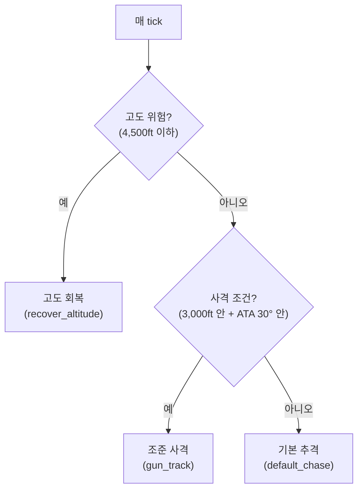

# 3. 행동트리(BT)가 뭔가 — 문법을 처음부터

[← 2. 규칙 핵심](02_rulebook_essentials.md) · [목차](README.md) · 다음: [4. 공중전 기초](04_bfm_basics.md)

행동트리는 **"매 tick(1/20초)마다 뭘 할지 정하는 규칙의 우선순위 목록"**이다.
if-elif-elif-...-else 를 트리 모양으로 쓴다고 생각하면 된다.

## 3.1 다섯 가지 노드가 전부다

| 노드 | 의미 |
|---|---|
| `selector` | **"위에서부터 먼저 성공하는 자식 하나만 실행"** — if/elif/elif 체인 |
| `sequence` | **"자식이 전부 성공해야 성공"** — 보통 `[조건, 조건, ..., 행동]` 순서로 써서 "이 조건들이 다 맞으면 이 행동" 을 표현한다 |
| `condition` | 지금 상황이 참/거짓인지 검사만 한다(예: "적이 3,000ft 안에 있나?") |
| `action` | 실제 조종 명령(예: "적을 향해 조준 추격") |
| `inverter` | 자식의 성공/실패를 뒤집는다 |
| `commit` / `cooldown` | 아래 3.3절 참고 — "관성"을 준다 |

## 3.2 selector가 곧 우선순위다

```yaml
selector:                                  # 위에서부터 먼저 참인 분기를 채택
  - sequence:                              # 규칙 1: 위험하면 먼저 살고 본다
      - condition: {name: low_altitude, floor_ft: 4500}
      - action: {pursuit: pure, g_burst: 0.8, aim_above_ft: 4000, name: recover_altitude}
  - sequence:                              # 규칙 2: 총을 쏠 수 있으면 쏜다
      - condition: {name: in_gun_envelope, range_ft: 3000, ata_deg: 30}
      - action: {pursuit: pure, name: gun_track}
  - action: {pursuit: pure, name: default_chase}   # 규칙 3: 그 외엔 그냥 추격
```

이걸 그림으로 그리면:



**왜 순서가 이렇게인가?** — selector는 **첫 번째로 성공하는 것만** 실행하고
멈춘다. 그래서 **더 급한 것을 위에 둬야 한다.** 고도 위험(죽으면 다 끝)이
사격(이기는 것)보다 위에 있는 이유가 이거다 — 룰북 §5에서도 하드덱 위반이
"상대 HP 0"보다 우선순위가 높다.

> **가장 흔한 초보 실수**: 순서를 잘못 두면 "이길 수 있는 상황인데 방어
> 분기가 먼저 걸려서 못 쏘는" 일이 생긴다. 반대로 사격 분기를 방어보다 위에
> 두면 위험한데도 계속 쫓다가 하드덱을 뚫는다. **급함 순서 = 트리 위→아래
> 순서**라는 것만 기억하면 절반은 한 것이다.

## 3.3 왜 조건마다 "거리 게이트"가 필요한가

```yaml
# 나쁜 예 — 거리 제한이 없다
- sequence:
    - condition: {name: foe_threat, aspect_deg: 120}   # 적이 나를 조준 중
    - action: {pursuit: lag, name: break_defense}       # 방어 브레이크
```

`foe_threat`는 "적이 내 정면에서 조준 중"만 본다 — **거리는 안 본다.** 그러면
적이 10km 밖에서 대충 내 쪽을 보고만 있어도 이 분기가 발동해서 **원거리
위협에도 매번 도망을 간다.** 실전에서 쓸모없는 방어가 아니라 **항상 수세로
고착되는 트리**가 나온다. 그래서:

```yaml
# 좋은 예 — 거리 게이트 추가
- sequence:
    - condition: {name: foe_threat, aspect_deg: 120}
    - condition: {name: merged, range_ft: 6000}          # 이게 핵심 — 근접일 때만
    - action: {pursuit: lag, g_burst: 0.8, name: break_defense}
```

**규칙: 방어/전술 분기에는 항상 거리(또는 사거리) 조건을 같이 걸어라.** 각도
조건 하나만 걸면 "멀리서도 발동하는 유령 위협"에 트리가 낭비된다.

## 3.4 `commit`/`cooldown` — "매 tick 뒤집힘"을 막는 법

조건이 트리 평가 주기(20Hz, 즉 0.05초마다)마다 다시 계산된다는 게 문제가 되는
경우가 있다. 예를 들어 "적이 아래로 지나갔으면 재강하 공격, 아직 안 지나갔으면
상승"이라는 2단계 요요 기동을 조건만으로 짜면, 경계값 근처에서 조건이 매
tick 참/거짓을 오가면서 **국면1↔국면2가 계속 뒤집혀 요요 자체가 성립하지
않는다.**

```yaml
commit:                          # "한 번 채택한 자식 명령은 duration_s 동안 유지"
  name: high_yoyo
  duration_s: 4.0                 # 4초 동안은 무슨 일이 있어도 이 기동을 계속한다
  cooldown_s: 3.0                 # 끝난 뒤 3초는 재진입 금지(연속 요요 방지)
  child:
    selector:
      - sequence: [...]           # 국면2 — 재강하
      - sequence: [...]           # 국면1 — 상승
```

- **`commit`**: 들어간 뒤 `duration_s` 동안 붙잡아 둔다 — 기동을 **끝까지
  마치게** 한다. 요요처럼 "완주해야 의미 있는" 기동에 쓴다.
- **`cooldown`**: 끝난 뒤 `wait_s` 동안 **재진입을 막는다.** 에너지 회복처럼
  "경계에서 왔다갔다하며 자꾸 붙었다 떨어지는" 분기에 쓴다.

**규칙: 수직 기동(요요)이나 안전이 걸린 분기는 `commit` 없이 조건만 쓰면
매 tick 뒤집힌다 — 반드시 래핑할 것.**

> 이 규칙을 "안다"는 것과 "모든 분기에 실제로 적용한다"는 것은 다르다 — 이
> 프로젝트도 요요 분기엔 처음부터 `commit`을 썼지만, 정작 가장 중요한
> 하드덱 회피 분기엔 한동안 빠뜨려서 실전에서 크게 대가를 치렀다. 자세한
> 사건 경위는 [06장](06_lessons_from_the_trenches.md#로그-2--가장-중요한-곳에-정작-빠뜨린-것-2026-09-01-오전)
> 참고.

## 3.5 액션 파라미터 빠른 참조

| 키 | 값 | 의미 |
|---|---|---|
| `pursuit` | `lead`/`pure`/`lag` | 추격 기하 — lead(앞 조준)/pure(현 위치)/lag(뒤) |
| `g_burst` | 0~1 | 지령 G 천장. 0=지속 봉투(에너지 보존), 1=순간 봉투 전량(에너지 소모) |
| `g_full_ata_deg` | 20~90 | 명목 G에 포화하는 각도 — 작을수록 공격적 |
| `aim_above_ft` | -5000~5000 | 조준점 수직 오프셋(+위/−아래) — 요요의 재료 |
| `lead_time_s`/`lag_dist_ft` | 0~3 / 0~8000 | lead 예측시간 / lag 후방거리 |
| `track_rng_ft`/`track_ata_deg` | 1000~3000 / 10~30 | 사격 국면 전용 G 부스트 창 |
| `mode` | `control_zone`/`stable` | 존 유지·오버슈트 억제 / 헤드온 안정 추적 |
| `cz_range_ft` | 500~6000 | control zone 목표 거리(`mode: control_zone`일 때만) |

전체 어휘와 기본값·허용 범위는 [`../reference/REFERENCE.md`](../reference/REFERENCE.md)가
단일 진실이다(엔진 코드에서 자동 생성되어 항상 최신). 각 파라미터가 실제로
어떤 물리 반응을 내는지(선회율·상승률 실측치)는
[`../reference/MEASURED_BEHAVIOR.md`](../reference/MEASURED_BEHAVIOR.md)에 있다.

---

이전: [2. 규칙 핵심](02_rulebook_essentials.md) · 다음: [4. 공중전 기초](04_bfm_basics.md)
