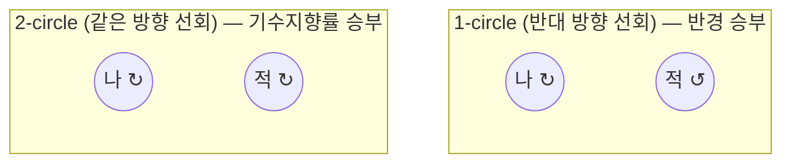

# 4. 공중전(BFM) 기초 — 이 대회가 쓰는 용어만

[← 3. 행동트리 문법](03_behavior_trees_101.md) · [목차](README.md) · 다음: [5. 나의 첫 트리](05_first_tree_walkthrough.md)

BEM(Basic Fighter Maneuvers) 교범 전체는 방대하다(이 SDK의 교리 파라미터는
RoKAF F-16C BEM Vol.5 (2005) Ch.4를 근거로 한다 — `reference/REFERENCE.md`
참고). 여기서는 **이 SDK의 조건 어휘에 실제로 쓰이는 개념만** 추린다.

## 4.1 세 각도 — ATA / AA / HCA

이 세 각도만 정확히 구분하면 [`../reference/REFERENCE.md`](../reference/REFERENCE.md)의
조건 표가 훨씬 쉽게 읽힌다.

| 각도 | 뭘 재나 | 0°가 뜻하는 것 | 어디 쓰이나 |
|---|---|---|---|
| **ATA** | **내 기수(종축)** → 적 방향 각도 | 0° = 내가 적을 정조준 | Gun WEZ 판정, `in_gun_envelope`, `nose_far` |
| **AA (aspect)** | **적의 꼬리** 기준 내 위치각 | 0° = 내가 적의 6시(바로 뒤), 180° = 적이 나를 정면 조준 | `foe_threat`, `behind_foe`, `is_offensive`/`is_defensive` |
| **HCA** | 두 기체 **종축**의 교차각 | 0° = 같은 방향, 180° = 정면 대향 | `is_head_on`, 헤드온 머지 판정 |

말로 풀면:
- **ATA(내가 쏘는 각)**: "내가 총구를 얼마나 정확히 적에게 대고 있나" — 이게
  작을수록 데미지가 크다([2장](02_rulebook_essentials.md#24-총gun-wez-판정--여기가-승부처)).
- **AA(적이 나를 어떻게 보나)**: "나는 지금 적의 몇 시 방향에 있나" — 내가
  적 6시(뒤)에 있으면 AA≈0°(내가 유리, 공세), 적이 내 뒤에 있으면 AA≈180°(내가
  불리, 수세).
- **HCA(서로 어느 방향을 보고 있나)**: 180°면 정면으로 마주보며 접근 중
  (헤드온/머지), 0°면 같은 방향으로 나란히 날고 있다는 뜻.

> **실수하기 쉬운 지점**: ATA와 AA를 헷갈리면 조건을 정반대로 쓰게 된다.
> "내가 유리한 상황"을 걸고 싶으면 `behind_foe`(AA 기반, 내가 적 후방인가)를,
> "내가 정확히 조준하고 있나"를 걸고 싶으면 `in_gun_envelope`/`nose_far`(ATA
> 기반)를 쓴다는 걸 기억할 것.

## 4.2 세 국면 — HABFM / OBFM / DBFM

| 국면 | 뜻 | 판정 | 대응 |
|---|---|---|---|
| **HABFM** | 대등한 헤드온 머지 | HCA 큼(정면 대향) | `is_head_on` — 안정적으로 노즈온 추적하며 머지 |
| **OBFM** | 내가 공세(적 후방) | AA 낮음(`behind_foe`) | `is_offensive` — 컨트롤존 진입·유지, 사격 기회 관리 |
| **DBFM** | 내가 수세(적이 내 뒤) | AA 높음(`foe_threat` 등) | `is_defensive` — 브레이크·역전 시도 |

이 대회 시나리오([2.3절](02_rulebook_essentials.md#23-시나리오-4종--골고루-잘해야-한다))가
정확히 이 세 국면 + 중립 머지를 하나씩 커버한다.

## 4.3 1서클 / 2서클 — 선회 방향이 같은가 다른가

- **1서클(`one_circle`)**: 양측이 **반대 방향**으로 돌며 원 하나를 공유한다.
  이때는 **선회 반경**이 승부다 — 더 작게 도는 쪽이 유리.
- **2서클(`two_circle`)**: 양측이 **같은 방향**으로 돈다. 이때는 반경이 아니라
  **기수 지향률(rate)**이 승부다 — 더 빨리 기수를 상대에게 돌리는 쪽이 유리.
  그래서 트리에서 1서클엔 `pure`(조준 오차 최소화 → 자연히 작은 반경),
  2서클엔 `lead`(미래점을 노려 기수를 더 빨리 세움)를 쓴다.

## 4.4 요요(Yo-Yo) — 수직을 써서 각/거리 문제를 푼다

- **하이 요요**: 너무 빨리 접근해서(과접근) 추월 위험이 있을 때, 조준점을
  **위로** 던져 수직으로 에너지를 소산하며 접근율을 줄인다. 정점에서 적이
  아래로 지나가면 다시 리드로 재강하 공격(2국면).
- **로우 요요**: 아직 기수도 못 물고 각도 열세인데 접근율도 없을 때, 조준점을
  적 선회원 **아래**로 던져 중력 가속으로 안쪽을 파고들어 각을 회수한다.

둘 다 `aim_above_ft`(조준점 수직 오프셋)로 만드는 기동이고,
[3.4절](03_behavior_trees_101.md#34-commitcooldown--매-tick-뒤집힘을-막는-법)의
`commit`이 반드시 필요하다(경계에서 뒤집히면 요요가 안 된다).

## 4.5 컨트롤존(Control Zone)

공세 국면(OBFM)에서 오버슈트(너무 앞질러 나가 위치를 잃는 것) 없이 적 후방
2,000~3,000ft 존에 머무르는 것. `mode: control_zone`을 쓰면 조절기가 오버슈트를
억제하는 방식으로 그 거리를 유지해준다 — 사격 기회를 노리며 버티는 자세다.

---

이전: [3. 행동트리 문법](03_behavior_trees_101.md) · 다음: [5. 나의 첫 트리](05_first_tree_walkthrough.md)
