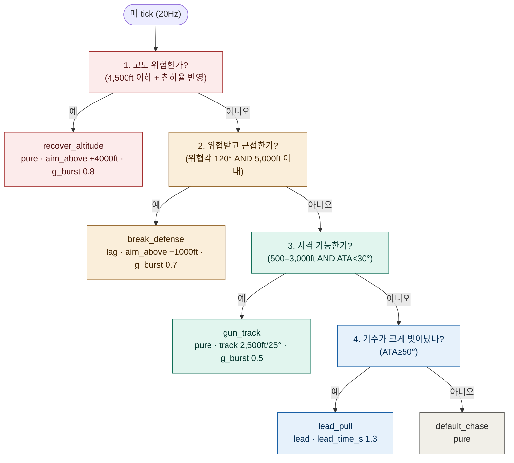

# 9. 스파링용 기본 상대 — RedBasic

[← 8. 용어 사전과 참고 자료](08_glossary_and_resources.md) · [목차](README.md)

`examples/starter.yaml`(문법 학습용, 방어 없음)과 우리 실전 제출 트리
(`../agents/agent.yaml`, 20분기)의 중간에 있는 **test sample**이다 —
[`../reference/examples/red_basic.yaml`](../reference/examples/red_basic.yaml).
5개 분기로, [7장 체크리스트](07_common_mistakes_checklist.md)의 핵심 규칙
(안전 최우선, 방어 분기 거리 게이트)을 지키면서도 한눈에 읽힌다. 자가대전
스파링 상대나, "이 정도 트리면 이 정도로 싸운다"는 기준점으로 쓰라고 만들었다.

## 트리 전문

```yaml
agent_name: RedBasic
selector:
  - sequence:
      - condition: {name: low_altitude, floor_ft: 4500, lookahead_s: 3.0}
      - action: {pursuit: pure, g_burst: 0.8, aim_above_ft: 4000, name: recover_altitude}
  - sequence:
      - condition: {name: foe_threat, aspect_deg: 120}
      - condition: {name: merged, range_ft: 5000}
      - action:
          {pursuit: lag, lag_dist_ft: 3000, aim_above_ft: -1000, g_burst: 0.7,
           name: break_defense}
  - sequence:
      - condition: {name: in_gun_envelope, range_ft: 3000, ata_deg: 30}
      - action:
          {pursuit: pure, g_burst: 0.5, track_rng_ft: 2500, track_ata_deg: 25,
           name: gun_track}
  - sequence:
      - condition: {name: nose_far, ata_deg: 50}
      - action: {pursuit: lead, lead_time_s: 1.3, name: lead_pull}
  - action: {pursuit: pure, name: default_chase}
```

## BT 그림



(색은 우선순위 5단계를 구분하는 용도다: 빨강=안전, 주황=방어, 초록=사격,
파랑=재정렬, 회색=기본값. [3.2절](03_behavior_trees_101.md#32-selector가-곧-우선순위다)에서
설명한 것처럼, selector는 **위에서부터 처음 참인 것 하나만** 실행하고 멈춘다
— 그래서 색이 위→아래로 갈수록 "얼마나 급한 상황인가"를 나타낸다.)

## 분기별 설명

| # | 이름 | 언제 발동 | 왜 이 순서인가 |
|---|---|---|---|
| 1 | `recover_altitude` | 고도 4,500ft 이하(강하율 반영해 미리) | 하드덱(1,000ft) 위반은 즉시 패([2.5절](02_rulebook_essentials.md#25-승패-판정-순서-위가-먼저-적용됨) #1) — 다른 무엇보다 먼저 살고 봐야 한다 |
| 2 | `break_defense` | 위협받는 중(`foe_threat`) **+** 5,000ft 이내(`merged`) | 거리 게이트가 없으면 원거리 위협에도 매번 도망가는 트리가 된다 — [3.3절](03_behavior_trees_101.md#33-왜-조건마다-거리-게이트가-필요한가)의 핵심 규칙을 그대로 적용한 예 |
| 3 | `gun_track` | Gun WEZ 전 대역 안(500–3,000ft, ATA<30°) | 여기가 "이기는" 분기 — 안전·방어 다음으로 최우선 |
| 4 | `lead_pull` | 기수가 적에서 50° 이상 벗어남 | 조준을 다시 잡으러 가는 절차 |
| 5 | `default_chase` | 위 어디에도 안 걸림 | 아무 조건도 안 맞을 때의 안전한 기본 동작 |

## 실제로 돌려본 결과

로컬 SDK(Python 3.14, 실제 `ai-combat-core2` 엔진)로 직접 3경기 돌려본
결과다 — 추측이 아니라 실측이다.

### 매치 1 — vs `examples/starter.yaml`, `headon`

최종 HP Starter 56 : RedBasic 73(RedBasic 우세). 22.6초에 첫 교전에서 서로
명중, 이후 291.8초까지 긴 추격전으로 이어졌다(엔진 자체 wall-clock
안전장치로 종료 — 룰북 §5 #5, 이 컴퓨터에서 물리 계산이 실시간보다 느려
생긴 것이지 트리 문제는 아니다). RedBasic의 분기 점유:

| 분기 | 점유 시간 | 비율 |
|---|---|---|
| `lead_pull` | 183.5s | 63% |
| `default_chase` | 40.0s | 14% |
| `recover_altitude` | 39.6s | 14% |
| `break_defense` | 28.6s | 10% |
| `gun_track` | 0.0s | 0% |

### 매치 2 — vs `examples/energy_fighter.yaml`, `neutral`

**무승부, 무교전(둘 다 명중 0건).** 256.7초 동안 양측 다 한 발도 못
맞혔다 — RedBasic의 minATA는 29.8°(WEZ 문턱 30° 바로 위에서 정체),
energy_fighter의 minATA는 25.5°로 문턱 아래까지 내려갔는데도 InWEZ는
**0.0초**였다. 각은 됐는데 거리가 안 맞았거나, 맞는 순간이 너무 짧았다는
뜻이다.

### 매치 3 — 우리 실전 트리(`agents/agent.yaml`) vs RedBasic, `perch_defense`

**무승부, 무교전 — 그것도 `no_contact`.** 룰북 §5 6번을 그대로 맞았다:
300초 내내 피해 교환이 0이면 무승부가 아니라 **양쪽 다 0점**이다
([2.5절](02_rulebook_essentials.md#25-승패-판정-순서-위가-먼저-적용됨)에서
경고한 바로 그 함정). RedBasic의 minATA는 이 경기에서 **0.3°**까지
내려갔다 — 정조준에 가까운 순간이 실제로 있었다는 뜻인데도, InWEZ는 역시
0.0초였다.

### 세 경기를 같이 놓고 보면

`gun_track`/`InWEZ`가 세 경기 다 사실상 0에 가깝다 — 이게 우연이 아니다.
RedBasic은 각도를 조이는 분기(`gun_track`)를 단 하나만 갖고 있고, 그마저도
"각도<30° **그리고** 거리 500–3,000ft"가 **동시에** 참이어야 발동한다. 매치
2·3에서 각도는 여러 번 문턱 근처(심지어 매치 3은 0.3°!)까지 내려갔지만
거리와 동시에 맞은 적이 없었다. **이게 [6장 로그 3](06_lessons_from_the_trenches.md#로그-3--조이는-도구의-문턱이-오히려-손발을-묶은-사례-2026-09-01--09-02)에서
우리 실전 트리(20분기짜리 `agent.yaml`)가 40경기 배터리 전체에서 겪은 것과
정확히 같은 증상**이다 — 방금 5분기짜리 장난감 트리로 3경기 만에 같은
벽에 부딪힌 걸 직접 본 것이다. 요요·컨트롤존·`track_*` 같은 도구가
왜 필요한지, 왜 이 대회 최상위 트리들이 거기 공을 들이는지 — 이게 그
이유다: **"각도 되면 언젠가 거리도 맞겠지"는 안 통한다.** 각·거리를
동시에 조이는 능동적인 도구가 없으면, 아무리 여러 번 좋은 각을 만들어도
사격 창을 열지 못한 채 시간만 흐른다.

## 이 트리의 한계 — 의도적으로 남겨둔 것들

RedBasic은 "단순함을 보여주는 예제"이지 "이기기 위한 트리"가 아니다. 일부러
빼놓은 것들:

- **요요(Yo-Yo)가 없다** — 과접근이나 각도 열세를 수직으로 풀 방법이 없다.
  그래서 `commit`도 필요 없다(요요처럼 국면이 여러 개인 기동만 `commit`이
  필요하다, [3.4절](03_behavior_trees_101.md#34-commitcooldown--매-tick-뒤집힘을-막는-법)).
  단순함의 대가로 위 실측처럼 `gun_track`에 거의 못 들어간다.
- **컨트롤존 유지가 없다** — 공세 국면(OBFM)에서 사격 기회를 벌기 위해 적
  후방에 머무르는 로직이 없다. 유리한 위치를 잡아도 오버슈트를 억제하지
  못하고 지나칠 수 있다.
- **1서클/2서클 구분이 없다** — 항상 같은 `pursuit` 전략을 쓴다. 선회
  방향에 따라 반경/기수지향률 승부가 다르다는 걸 반영하지 못한다
  ([4.3절](04_bfm_basics.md#43-1서클--2서클--선회-방향이-같은가-다른가)).
- **에너지 관리가 `recover_altitude` 하나뿐**이다 — 속도가 떨어져도(실속
  위험) 별도로 대응하지 않는다. 룰북 §5의 실속 위반(100kt 미만 10초)에
  취약할 수 있다.

**다음 연습**: 이 트리를 복사해서 위 한계 중 하나를 채워보는 게 좋은 연습이다
— 예를 들어 `examples/energy_fighter.yaml`의 요요 패턴을 참고해 `commit`으로
감싼 2국면 요요 분기를 `gun_track`과 `lead_pull` 사이에 추가해보고, 같은
`--scenario headon --seed 1` 매치를 다시 돌려 `gun_track` 점유가 늘어나는지
직접 확인해볼 것.

## 직접 돌려보기

```bat
python scripts\run_match.py --scenario headon --seed 1 ^
  --blue my_agents\my_agent.yaml --red reference\examples\red_basic.yaml --analyze
```

4가지 시나리오(`headon`/`perch_offense`/`perch_defense`/`neutral`) 전부에서
자기 트리와 붙여보고, 리플레이의 `ActiveNode`로 RedBasic이 매 순간 뭘 하고
있는지 확인해볼 것 — 이게 [5장](05_first_tree_walkthrough.md)에서 배운
디버깅 워크플로 그대로다.

---

이전: [8. 용어 사전과 참고 자료](08_glossary_and_resources.md) · [목차](README.md)
